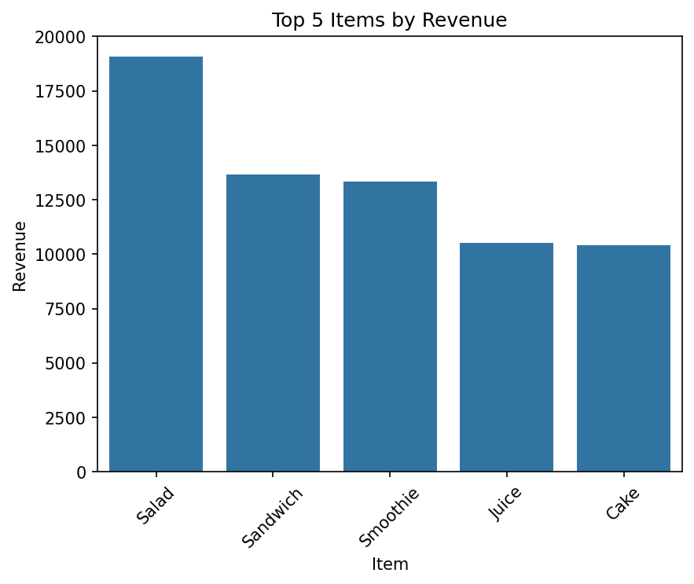
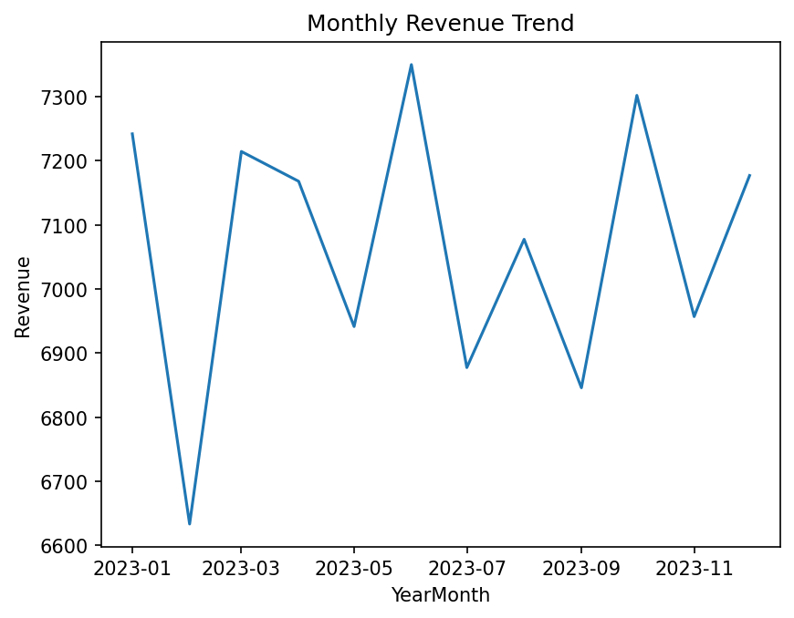
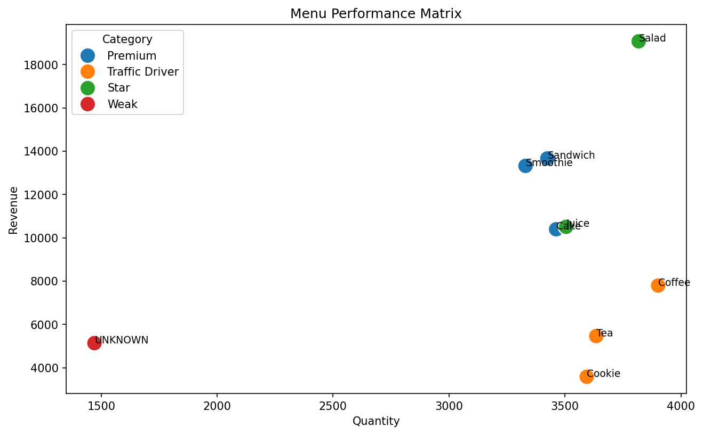

# cafe-sales-performance-analysis
Analyzed transactional cafe sales data using Python to identify revenue drivers, high‑volume traffic items, and seasonal trends. Built a menu performance matrix to classify products and translate findings into actionable pricing, promotion, and bundling recommendations

## Business Question
Which menu items drive the most revenue and volume, how does performance vary over time,
and what strategies could improve underperforming products?

## Project Overview
This project analyzes transactional sales data from a cafe to uncover revenue patterns,
classify menu performance, and generate actionable business recommendations.

The analysis demonstrates an end-to-end analytics workflow: from cleaning messy real-world
data to delivering insights that support pricing, promotion, and product strategy decisions.

## 📊 Interactive Dashboard (Looker Studio)
**Dashboard link:** https://datastudio.google.com/reporting/fec28d96-10b4-4c23-9ac4-225553181ef0

This dashboard complements the Python notebook by enabling interactive exploration of:
- Revenue by menu item
- Monthly revenue trends
- Sales volume by day of week

**How to use the filters**
- Use **Item** to focus on a single product (or compare multiple)
- Use **YearMonth / Date range** to zoom into specific months
- Click a chart element to cross-filter (click blank space to clear)

## 🖼️ Key Visualizations (static)

### Total Revenue by Menu Item

### Monthly Revenue Trend

### Menu Performance Matrix
Revenue vs. quantity comparison used to classify items as Stars, Premiums, Traffic Drivers, or Weak performers.

## Tools & Skills
- Python (Pandas, NumPy)
- Data cleaning & feature engineering
- Exploratory data analysis (EDA)
- Time-series analysis
- Data visualization (Matplotlib, Seaborn)
- Business insight & storytelling

## Key Insights
- **Salad** is the top revenue driver and a consistent *Star* item.
- **Coffee** drives high volume but lower revenue, making it ideal for bundling strategies.
- **Sandwich** ranks 2nd in revenue despite moderate volume, indicating strong per-unit profitability.
- **Juice** shows strong overall performance with a July dip, suggesting seasonal effects.
- **Tea and Cookie** sell frequently but contribute low revenue, highlighting pricing or bundling opportunities.

## Business Recommendations
- Bundle traffic-driving items (Coffee, Tea) with higher-margin products.
- Stabilize high-revenue items (Sandwich, Smoothie) with targeted promotions.
- Test small price increases on low-revenue, high-volume items.
- Monitor seasonal performance shifts for Juice and Smoothies.

## Files
- `cafe_sales_analysis.ipynb` — full analysis notebook
- `dirty_cafe_sales.csv` — raw dataset
- `images/` — exported visualizations

